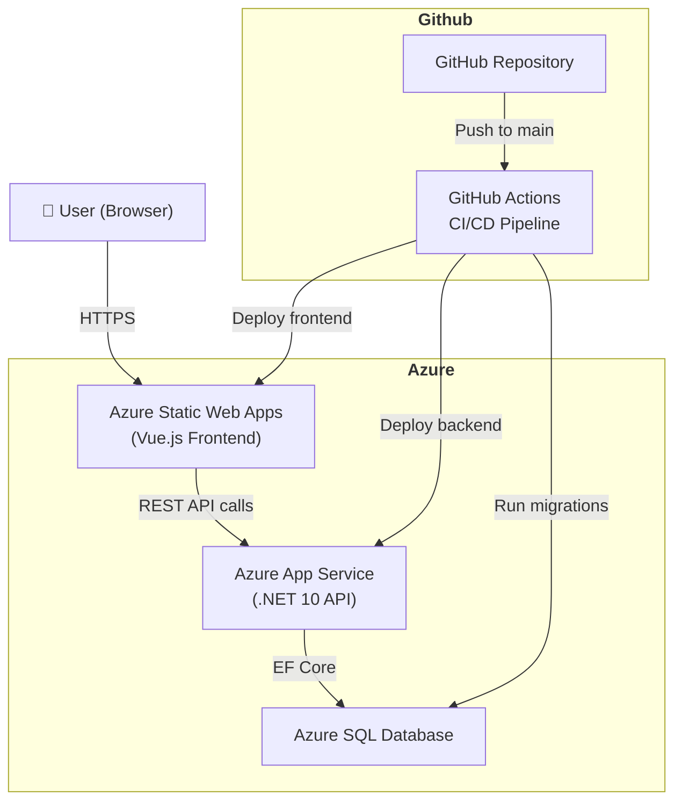
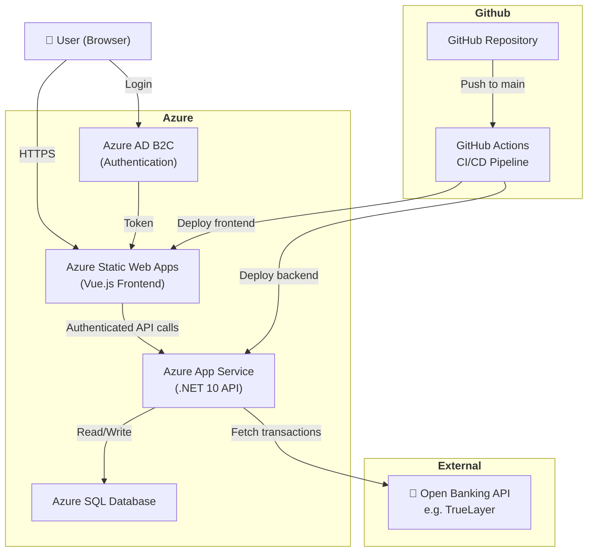
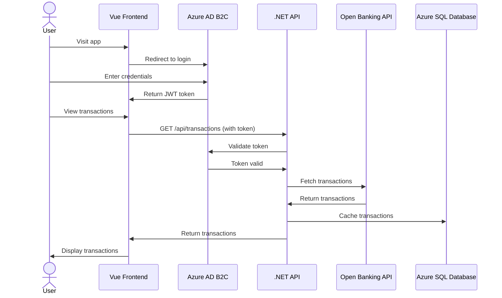
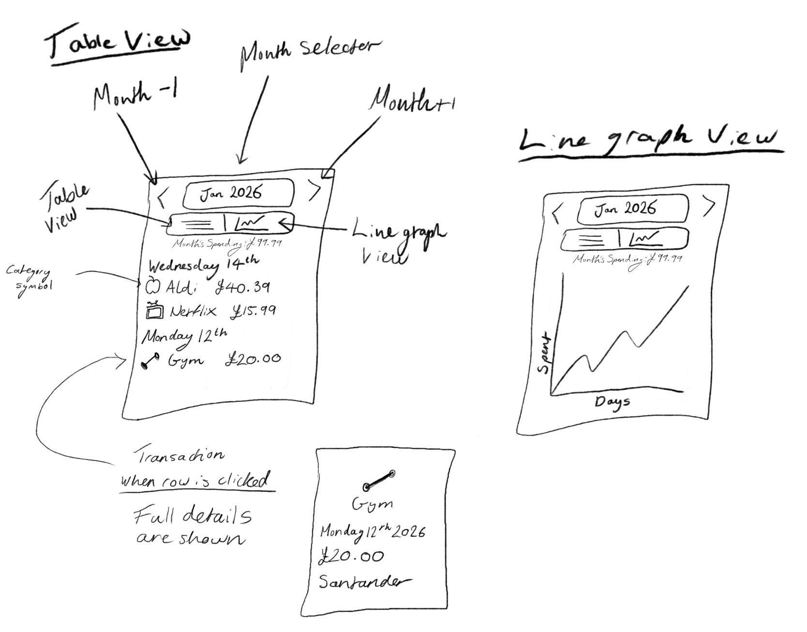
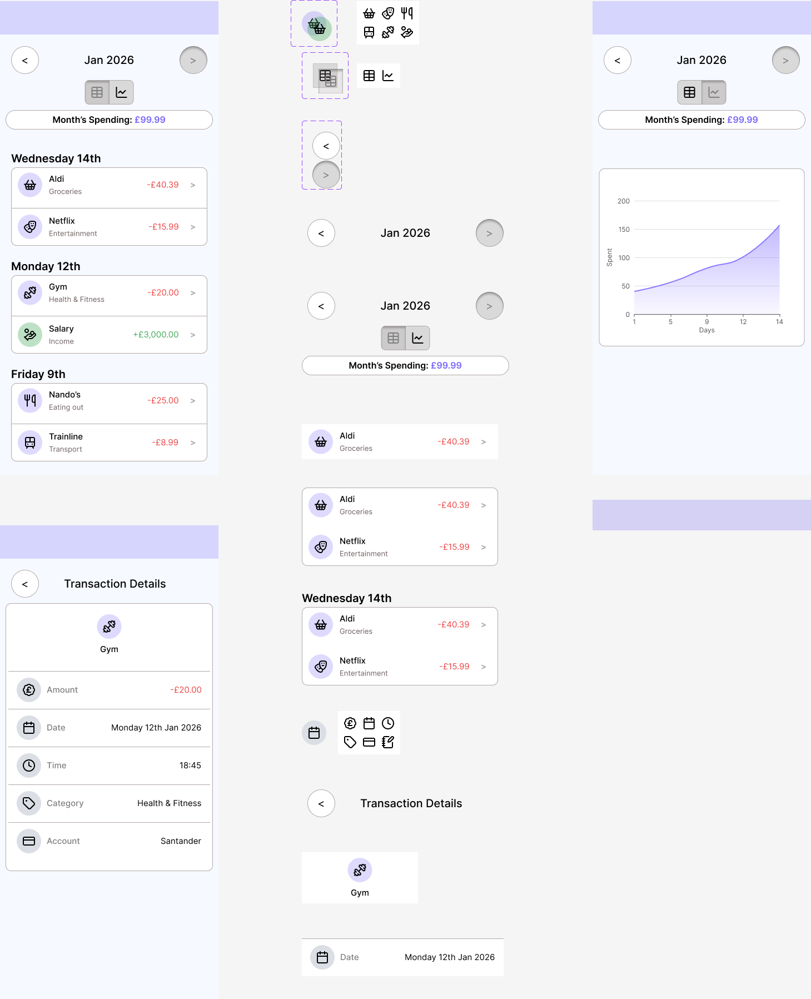

# 💰 Budget Tracker

A full stack budgeting web application built with Vue.js and .NET 10, hosted on Microsoft Azure.

---

## 🚀 Tech Stack

| Layer | Technology |
|---|---|
| Frontend | Vue.js 3, TypeScript, Vite |
| Backend | .NET 10, ASP.NET Core Web API |
| ORM | Entity Framework Core 10 |
| Database | Azure SQL Database |
| Hosting | Azure Static Web Apps (frontend), Azure App Service (backend) |
| CI/CD | GitHub Actions |
| Planned: Auth | Azure AD B2C |
| Planned: Banking | Open Banking API (e.g. TrueLayer) |

---

## 🏗️ Architecture

### Current



### Planned



### Planned Authentication & Data Flow



---

## 🎨 Wireframes

Hand-drawn wireframes showing the two main views of the application:



**Table View** — month selector, monthly total, and transactions grouped 
by date. Each row shows a category icon, description and amount (+ green for income, - red for expense). 
Tapping a row reveals full details including date, amount and account provider.

**Line Graph View** — same header with a cumulative spending line chart
plotting spend over days in the selected month.

---

## 🎨 Design

The UI was designed in Figma before implementation, following a mobile-first approach.

[View Figma Design](https://www.figma.com/design/P9OVt7zHkvlZZkgkuLV25F/Budget-Tracker?node-id=0-1&t=FV0f9lRPKh8CeMVw-1)



**Key design decisions:**
- Transactions grouped by date with category icons (Lucide)
- Red/green amount colouring for expenses and income  
- Segmented control toggle between table and line graph views
- Progressive disclosure — tap a row to reveal full transaction details
- Cumulative spending line graph for monthly trend visibility

---

## ✨ Features

### Current
- Transactions stored in Azure SQL Database via Entity Framework Core
- Transactions fetched from backend API and grouped by date
- Category icons per transaction type using Lucide Vue Next
- Red/green amount colouring for expenses and income
- Month selector with back/forward navigation
- Monthly spending total
- Table view and line graph view toggle
- Transaction detail page
- Vitest unit tests with CI integration via GitHub Actions
- Database migrations run automatically as part of the CI/CD pipeline
- Error and loading states handled in the frontend

### Planned
- Real bank account integration via Open Banking API (TrueLayer)
- User authentication via Azure AD B2C
- Spending breakdown by category

---

## 🛠️ Running Locally

### Prerequisites
- .NET 10 SDK
- Node.js 18+
- npm
- SQL Server LocalDB (installed with Visual Studio)
- EF Core CLI tools: `dotnet tool install --global dotnet-ef`

### Environment Variables

#### Frontend (`frontend/budget-tracker/.env.production`)

`VITE_API_URL` is used in production builds to point the frontend to the deployed backend API.

```bash
VITE_API_URL=https://your-backend-app.azurewebsites.net
```

In development, the frontend does **not** use `VITE_API_URL`; Vite proxies `/api/*` requests to `http://localhost:5103`.

#### Backend (`backend/BudgetTracker.Api/appsettings*.json` or environment)

Required backend configuration keys:
- `ConnectionStrings:DefaultConnection`
- `AllowedOrigins` (comma-separated list; defaults to `http://localhost:5173` when unset)

CI/CD supplies production values through GitHub secrets (for example `ConnectionStrings__DefaultConnection` and `VITE_API_URL`).

### Backend

```bash
cd backend/BudgetTracker.Api
dotnet ef database update
dotnet run
```

`dotnet ef database update` creates the local `BudgetTrackerDb` database and runs all migrations. The app will seed it with sample data on first run.

### Frontend

```bash
cd frontend/budget-tracker
npm install
npm run dev
```

The frontend runs on `http://localhost:5173`.
The backend runs on `https://localhost:7259` and `http://localhost:5103`, and the Vite dev proxy uses `http://localhost:5103`.

---

## 🚢 Deployment

Both the frontend and backend are automatically deployed to Azure on every push to `main` via GitHub Actions.

- Frontend: Azure Static Web Apps
- Backend: Azure App Service
- Database migrations run automatically in the CI pipeline before deployment

---

## 🧪 Testing & Validation

### Frontend

```bash
cd frontend/budget-tracker
npm run test:run
npm run build
```

### Backend

```bash
cd backend/BudgetTracker.Api
dotnet build
```

There is currently no dedicated backend test project in the repository; `dotnet build` is used as the backend CI validation step.

---

## 🔌 API Contract

### `GET /api/transactions`

Returns a list of transactions sorted by date descending.

Example response item:

```json
{
  "id": "6f8f7f3a-0e53-4ebf-8e18-2f9f9dd5a2f2",
  "dateUtc": "2026-05-07T00:00:00Z",
  "description": "Tesco",
  "signedAmount": -42.50,
  "absoluteAmount": 42.50,
  "type": "expense",
  "category": "Groceries",
  "accountName": "Main Current Account",
  "monthKey": "2026-05",
  "dateKey": "2026-05-07"
}
```

---

## 📁 Project Structure

```text
BudgetTracker/
├── frontend/
│   └── budget-tracker/        # Vue 3 + TypeScript app
├── backend/
│   └── BudgetTracker.Api/     # ASP.NET Core API + EF Core
├── docs/
│   ├── screenshots/
│   └── wireframes/
└── .github/workflows/         # CI/CD pipelines
```

---

## ⚠️ Current Scope & Limitations

- Single-user style experience; no authentication enforced yet
- Transactions currently come from seeded/local database data, not live bank feeds
- Open Banking integration (e.g. TrueLayer) is planned but not implemented
- Azure AD B2C integration is planned but not implemented

---

## 🛠️ Troubleshooting

- Frontend cannot reach API in development:
  - Ensure backend is running and listening on `http://localhost:5103`
  - Ensure frontend is running on `http://localhost:5173` so CORS defaults apply
- HTTPS certificate warnings on backend:
  - Run `dotnet dev-certs https --trust` and restart the backend
- Migration failures locally:
  - Verify LocalDB is installed and `DefaultConnection` points to a valid SQL Server instance
  - Re-run `dotnet ef database update` from `backend/BudgetTracker.Api`
- Production frontend calling wrong API:
  - Verify `VITE_API_URL` GitHub secret and workflow environment values

---

## 🤝 Contributing

- Create a feature branch (for example `feature/month-summary` or `fix/api-error-state`)
- Keep PRs focused and small where possible
- Before pushing, run:
  - Frontend: `npm run test:run` and `npm run build`
  - Backend: `dotnet build`
- Open a PR to `develop` once checks are passing

---

## 📄 License
MIT