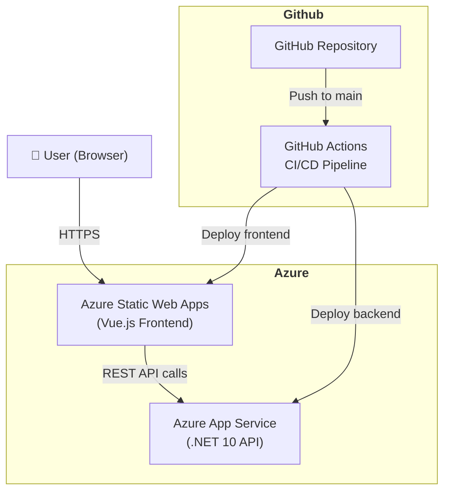
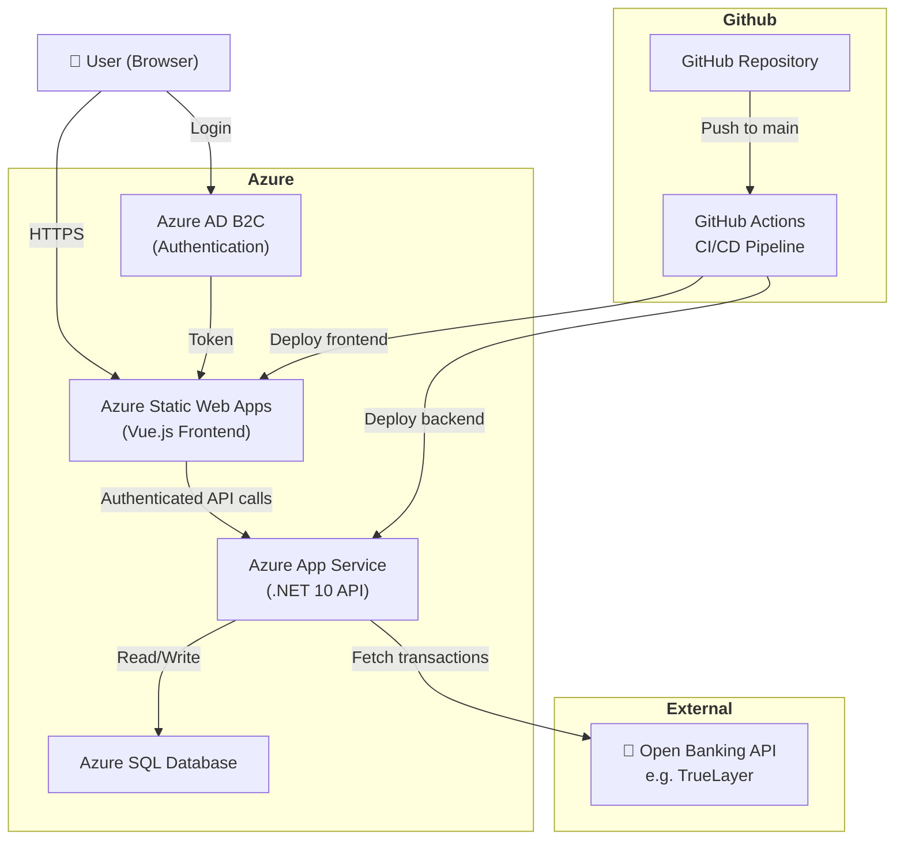
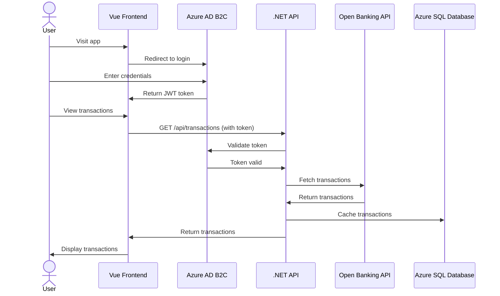

# 💰 Budget Tracker

A full stack budgeting web application built with Vue.js and .NET 10, hosted on Microsoft Azure.

---

## 🚀 Tech Stack

| Layer | Technology |
|---|---|
| Frontend | Vue.js 3, TypeScript, Vite |
| Backend | .NET 10, ASP.NET Core Web API |
| Hosting | Azure Static Web Apps (frontend), Azure App Service (backend) |
| CI/CD | GitHub Actions |
| Planned: Auth | Azure AD B2C |
| Planned: Database | Azure SQL |
| Planned: Banking | Open Banking API (e.g. TrueLayer) |

---

## 🏗️ Architecture

### Current



### Planned



### Planned Authentication & Data Flow



---

## 🎨 Wireframes

Hand-drawn wireframes showing the two main views of the application:


**Table View** — month selector, monthly total, and transactions grouped 
by date. Each row shows a category icon, description and amount (+ green for income, - red for expense). 
Tapping a row reveals full details including date, amount and account provider.

**Line Graph View** — same header with a cumulative spending line chart
plotting spend over days in the selected month.

---

## 🎨 Design

The UI was designed in Figma before implementation, following a mobile-first approach.

[View Figma Design](https://www.figma.com/design/P9OVt7zHkvlZZkgkuLV25F/Budget-Tracker?node-id=0-1&t=FV0f9lRPKh8CeMVw-1)


**Key design decisions:**
- Transactions grouped by date with category icons (Lucide)
- Red/green amount colouring for expenses and income  
- Segmented control toggle between table and line graph views
- Progressive disclosure — tap a row to reveal full transaction details
- Cumulative spending line graph for monthly trend visibility

---

## ✨ Features

### Current
- Transactions fetched from backend API and grouped by date
- Category icons per transaction type using Lucide Vue Next
- Red/green amount colouring for expenses and income
- Month selector with back/forward navigation
- Monthly spending total
- Table view and line graph view toggle
- Transaction detail page
- Vitest unit tests with CI integration via GitHub Actions
- Error and loading states handled in the frontend

### Planned
- Real bank account integration via Open Banking API (TrueLayer)
- User authentication via Azure AD B2C
- Spending breakdown by category
- Azure SQL database for persistence

---

## 🛠️ Running Locally

### Prerequisites
- .NET 10 SDK
- Node.js 18+
- npm

### Backend
```bash
cd backend/BudgetTracker.Api
dotnet run
```

### Frontend
```bash
cd frontend/budget-tracker
npm install
npm run dev
```

The frontend runs on `http://localhost:5173` and the backend on `https://localhost:7259`.

---

## 🚢 Deployment

Both the frontend and backend are automatically deployed to Azure on every push to `main` via GitHub Actions.

- Frontend: Azure Static Web Apps
- Backend: Azure App Service

---
## 📄 Licence
MIT